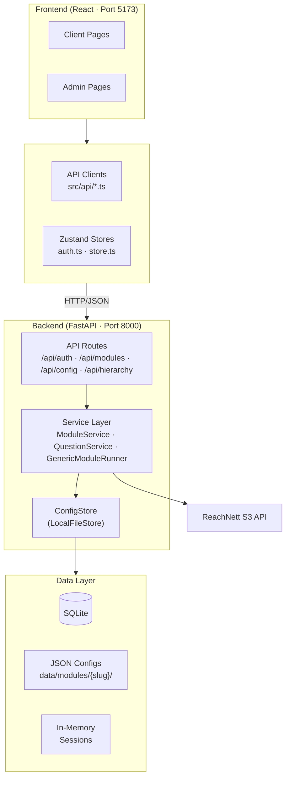

```mermaid

flowchart TB
    subgraph Frontend["Frontend (React · Port 5173)"]
        direction LR
        ClientPages[Client Pages]
        AdminPages[Admin Pages]
    end

    subgraph FE_Internal[" "]
        direction LR
        APIClients["API Clients<br/>src/api/*.ts"]
        Stores["Zustand Stores<br/>auth.ts · store.ts"]
    end

    subgraph Backend["Backend (FastAPI · Port 8000)"]
        Routes["API Routes<br/>/api/auth · /api/modules · /api/config · /api/hierarchy"]
        Services["Service Layer<br/>ModuleService · QuestionService · GenericModuleRunner"]
        ConfigStore["ConfigStore<br/>(LocalFileStore)"]
    end

    subgraph Data["Data Layer"]
        direction LR
        DB[(SQLite)]
        JSON["JSON Configs<br/>data/modules/{slug}/"]
        Memory["In-Memory<br/>Sessions"]
    end

    External["ReachNett S3 API"]

    Frontend --> FE_Internal
    FE_Internal -->|HTTP/JSON| Backend
    Routes --> Services --> ConfigStore --> Data
    Services --> External

```
