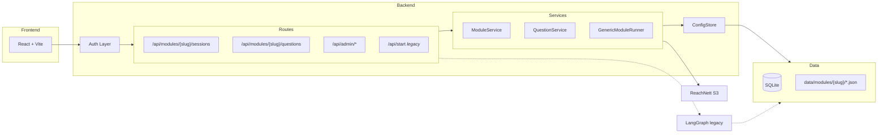

```mermaid

flowchart LR
    subgraph Frontend
        UI[React + Vite]
    end

    subgraph Backend
        Auth[Auth Layer]
        subgraph Routes
            R1["/api/modules/{slug}/sessions"]
            R2["/api/modules/{slug}/questions"]
            R3["/api/admin/*"]
            R4["/api/start <i>legacy</i>"]
        end
        subgraph Services
            MS[ModuleService]
            QS[QuestionService]
            GMR[GenericModuleRunner]
        end
        CS[ConfigStore]
    end

    subgraph Data
        DB[(SQLite)]
        JSON["data/modules/{slug}/*.json"]
    end

    External[ReachNett S3]

    UI --> Auth --> Routes --> Services --> CS --> Data
    Routes -.-> LG[LangGraph legacy] -.-> Data
    Services --> External


```
